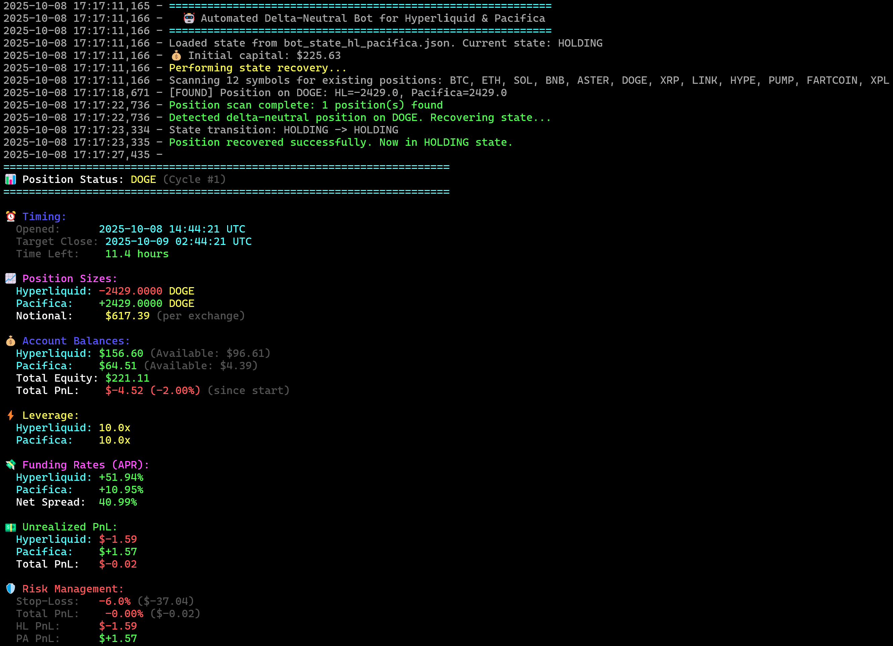

# 🤖 Hyperliquid-Pacifica Cross-Exchange Funding Rate Delta Neutral Bot

Automated delta-neutral bot that captures funding rate spreads between Hyperliquid and Pacifica perpetual futures exchanges.
Can be also used to farm trading volume while limit risk (refreshes positions every `hold_duration_hours=12` hours by default, but can be changed).

**💰 Support this project**:
- **Hyperliquid**: Sign up with [this referral link](https://app.hyperliquid.xyz/join/FREQTRADE) for 10% fee reduction
- **Pacifica**: Sign up at [app.pacifica.fi](https://app.pacifica.fi/) and use one of the following referral codes when registering (if one is already taken, try another):
  ```
  BYVJRCM791XFCF5K
  ENPVKJ1WAVYNV2Z0
  6HR2WM4C0JQ7D39Q
  411J9J7CYNFZN3SX
  2K7D40A9H53M2TJT
  S1G3A2063Q7410BV
  XH2V3VY9CQ7535CX
  EK8NXX12VDKJJWNK
  6NBS6TT7Y1SV2P53
  E5ZYTD2FVXJA123W
  ```

## 📊 Strategy

The bot maintains market-neutral positions by going **long on the exchange with lower funding rate** and **short on the exchange with higher funding rate**, collecting the funding rate differential while minimizing directional price risk.
Can be also used to farm trading volime while limit risk (refreshes positions every `hold_duration_hours=12` hours by default, but can be changed).

**💡 Example**: If Hyperliquid funding is +10% APR and Pacifica is +50% APR:
- Long position on Hyperliquid (pay 10%)
- Short position on Pacifica (receive 50%)
- Net profit: ~40% APR

## 🚀 Quick Start

### 1. 📦 Install Dependencies

```bash
pip install -r requirements.txt
```

### 2. 🔐 Configure Environment

Copy `.env.example` to `.env` and add your credentials:

```bash
cp .env.example .env
```

Edit `.env` with your API keys:
- **Hyperliquid**: Wallet address and private key
- **Pacifica**: Solana wallet, API public/private keys

### 3. ⚙️ Configure Bot

Edit `bot_config.json`:

```json
{
  "symbols_to_monitor": ["BTC", "ETH", "SOL", "ASTER", ...],
  "leverage": 3,
  "base_capital_allocation": 100.0,
  "hold_duration_hours": 12.0,
  "min_net_apr_threshold": 5.0
}
```

**Key Parameters**:
- `base_capital_allocation`: Base capital in USD (actual position = base × leverage × 0.98 buffer)
- `leverage`: Target leverage (auto-capped at 20x, reduced if exchange limits are lower)
- `hold_duration_hours`: How long to hold each position
- `min_net_apr_threshold`: Minimum funding spread to open position

### 4. ▶️ Run

```bash
python hyperliquid_pacifica_hedge.py
```

## 🐳 Docker Deployment

```bash
# Build the image
docker-compose build

# Build and start
docker-compose up -d

# View logs
docker-compose logs -f hedge-bot

# Stop
docker-compose down

# Rebuild after code changes
docker-compose build && docker-compose up -d
```

See `DOCKER.md` for detailed deployment guide.

## 🔄 How It Works

1. **🔍 Analyze**: Fetches funding rates from both exchanges and displays comparison table at startup and before each cycle
2. **🎯 Select**: Chooses symbol with highest net APR above threshold
3. **📈 Open**: Opens delta-neutral position (long/short) with synchronized leverage
4. **⏱️ Hold**: Monitors position health, PnL, and stop-loss for configured duration
5. **📉 Close**: Closes both positions simultaneously
6. **⏸️ Wait**: Brief cooldown before next cycle

## 🛡️ Safety Features

- ✅ **20x Leverage Hard Cap**: Never exceeds 20x regardless of config
- ✅ **Leverage Synchronization**: Both exchanges use identical leverage
- ✅ **Dynamic Stop-Loss**: Tighter stops at higher leverage (~60% capital loss trigger), **triggered by worst leg PnL** to protect against one-sided losses
- ✅ **2% Safety Buffer**: Automatic reduction of base capital allocation
- ✅ **Symbol Filtering**: Only trades symbols available on both exchanges
- ✅ **Volume Filtering**: Filters out symbols with <$100M 24h volume on Pacifica for better liquidity
- ✅ **State Recovery**: Automatically recovers position state after restart
- ✅ **Quantity Precision**: Uses coarser step size to ensure identical quantities
- ✅ **Long-term PnL Tracking**: Tracks initial capital and displays cumulative performance across all cycles

## 💵 Position Sizing Examples

With `base_capital_allocation: 100`:

| Leverage | Safety Buffer | Position Size per Exchange |
|----------|---------------|----------------------------|
| 1x       | $98           | $98                        |
| 3x       | $98           | $294                       |
| 5x       | $98           | $490                       |
| 10x      | $98           | $980                       |

Position size is further reduced if insufficient margin available (uses 95% of max available).

## ⛔ Stop-Loss Levels

Stop-loss is **triggered by the worst leg PnL** (not total PnL) to protect against one-sided losses that could lead to liquidation.

| Leverage | Stop-Loss % | Capital Loss at Trigger | Buffer Before Liquidation |
|----------|-------------|-------------------------|---------------------------|
| 1x       | -50%        | 50%                     | ~50%                      |
| 3x       | -20%        | 60%                     | ~40%                      |
| 5x       | -12%        | 60%                     | ~40%                      |
| 10x      | -6%         | 60%                     | ~40%                      |
| 20x      | -3%         | 60%                     | ~40%                      |

**When triggered**: Both positions are immediately closed via market orders, PnL is calculated, and the bot enters a waiting period (5 minutes by default) before starting a new cycle.

## 📊 Monitoring

The bot displays comprehensive color-coded status during position holding (every 60 seconds by default):



**Status includes:**
- Position timing and time remaining
- Position sizes and notional value
- Account balances and total equity
- **Long-term PnL** since bot start (tracked via initial capital)
- Current leverage on both exchanges
- Real-time funding rates and spread
- Individual leg PnL (Hyperliquid and Pacifica)
- Total unrealized PnL
- **Risk metrics**: Stop-loss level, current PnL %, worst leg performance, distance to stop-loss

## 📊 Funding Rates Checker

Check current funding rates across all symbols without running the bot:

```bash
# View funding rates for symbols in bot_config.json
python show_funding_rates.py

# Check specific symbols
python show_funding_rates.py --symbols BTC ETH SOL

# Use custom config file
python show_funding_rates.py --config my_config.json

# Set custom threshold for highlighting (default: 5.0%)
python show_funding_rates.py --threshold 10.0
```

**Features:**
- 🎯 Shows real-time funding rates from both exchanges
- 📈 Calculates net APR spread for each symbol
- 🎨 Color-coded opportunities (green = above threshold)
- 📊 Sorted by best opportunities first
- ⚡ Quick spot-check without starting the bot

## 📊 24h Volume Checker

Check trading volumes across both exchanges to assess liquidity:

```bash
# View volumes for symbols in bot_config.json
python show_volumes.py

# Check specific symbols
python show_volumes.py --symbols BTC ETH SOL

# Use custom config file
python show_volumes.py --config my_config.json
```

**Features:**
- 📊 Displays 24h trading volume from both exchanges
- 💰 Calculates total combined volume
- 📈 Shows market share distribution (Hyperliquid vs Pacifica)
- 🎨 Color-coded by volume tier (green >$1M, yellow >$100K)
- 📉 Sorted by total volume descending
- ⚡ Uses kline data for accurate Pacifica volumes

## 🚨 Emergency Position Closer

Close all open positions on both exchanges:

```bash
# Interactive mode - shows positions and asks confirmation
python emergency_close.py

# Close specific symbol only
python emergency_close.py --symbol BTC

# Close all without confirmation
python emergency_close.py --force

# Preview without executing
python emergency_close.py --dry-run
```

The script scans symbols from `bot_config.json` and displays all open positions with PnL before closing.

## 📁 Files

- `hyperliquid_pacifica_hedge.py` - Main bot
- `show_funding_rates.py` - Funding rates checker utility
- `show_volumes.py` - 24h volume checker utility
- `emergency_close.py` - Emergency position closer
- `hyperliquid_connector.py` - Hyperliquid exchange wrapper
- `pacifica_client.py` - Pacifica exchange client
- `bot_config.json` - Configuration
- `bot_state_hl_pacifica.json` - Persistent state (auto-created)
- `logs/hyperliquid_pacifica_hedge.log` - Log file (resets on start)

## ⚠️ Important Notes

- **Single Position**: Bot manages one position at a time
- **Symbol Filtering**: Symbols not on both exchanges are automatically ignored
- **Volume Filtering**: Symbols with <$100M 24h volume on Pacifica are filtered out at startup
- **Cycle Tracking**: Cycle number persists across restarts
- **Initial Capital**: Captured at first run and used for long-term PnL calculation
- **Monitoring Frequency**: Position checked every 60 seconds by default (`check_interval_seconds`)
- **Stop-Loss Protection**: Based on worst performing leg, not total PnL
- **Log Reset**: Log file resets on every bot start
- **UTC Timestamps**: All times displayed in UTC

## 📚 Documentation

- `CLAUDE.md` - Detailed architecture and development guide
- `DOCKER.md` - Comprehensive Docker deployment guide
- `.env.example` - Environment variable template

## 📋 Requirements

- Python 3.12+
- Active accounts on Hyperliquid and Pacifica
- Sufficient balance on both exchanges (~$50+ recommended per exchange)
- API credentials with trading permissions

## 📜 License

This bot is for educational and research purposes. Use at your own risk. Always test with small amounts first.


